# Architecture

## Stack and deployment shape

- **Build:** Maven WAR, **Java 21** (`pom.xml`).
- **Runtime:** Jakarta Servlet **6.0** (Tomcat 10+), `@WebServlet` mapping; `web.xml` only welcome files.
- **View:** JSP under `src/main/webapp/WEB-INF/views/`.
- **Controller:** `com.fashionstore.controller` — 15 servlets, no front controller.
- **Model:** POJOs in `com.fashionstore.model` (10 types).
- **Persistence:** `com.fashionstore.dao` + `dao.impl`, JDBC via `DBConnection`; MySQL driver 8.3.
- **Auth:** `org.mindrot:jbcrypt` — passwords hashed on register; login verifies BCrypt or legacy plain text (see [Login](#login-getpost-login)).

**Source tree (Java):**

```text
com.fashionstore/
  controller/     — *Servlet.java (15)
  dao/            — interfaces
  dao.impl/       — *DAOImpl.java
  model/          — domain POJOs
  util/           — DBConnection, DatabaseSelectTest, TestDB
```

## MVC layering

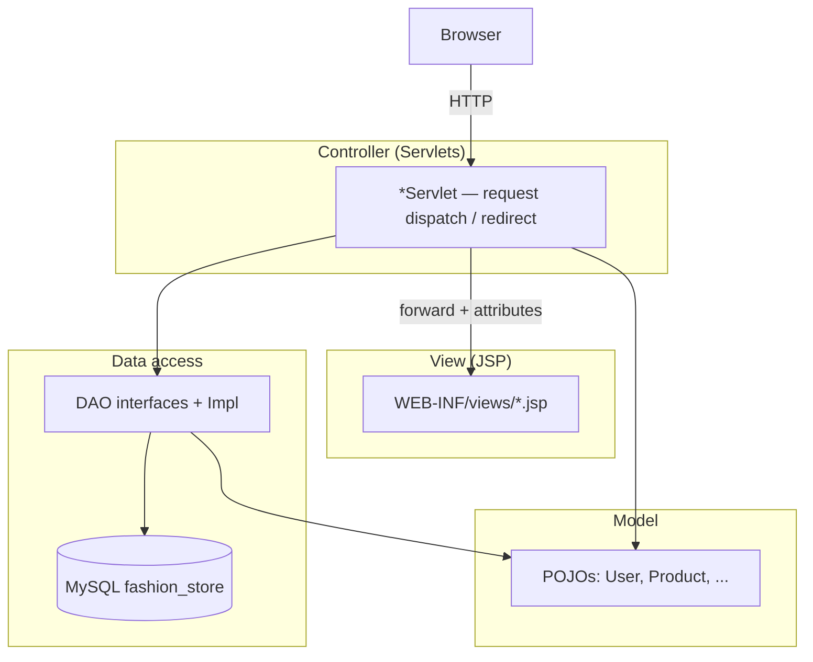
```mermaid
flowchart TB
  subgraph View["View (JSP)"]
    JSP["WEB-INF/views/*.jsp"]
  end
  subgraph Controller["Controller (Servlets)"]
    S["*Servlet — request dispatch / redirect"]
  end
  subgraph Model["Model"]
    M["POJOs: User, Product, ..."]
  end
  subgraph Data["Data access"]
    DAO["DAO interfaces + Impl"]
    DB[("MySQL fashion_store")]
  end
  Browser -->|HTTP| S
  S -->|forward + attributes| JSP
  S --> M
  S --> DAO
  DAO --> M
  DAO --> DB
```

**Note:** There is no dedicated service layer; servlets call DAOs directly.

## Package and folder structure

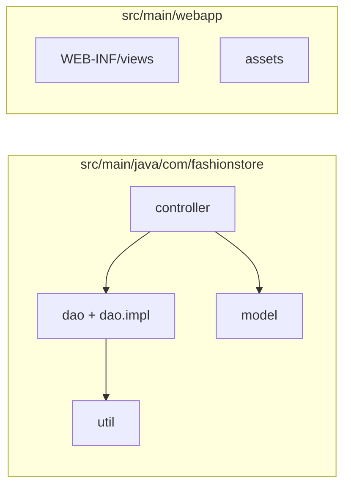
```mermaid
flowchart LR
  subgraph java["src/main/java/com/fashionstore"]
    C[controller]
    D[dao + dao.impl]
    M[model]
    U[util]
  end
  subgraph web["src/main/webapp"]
    V[WEB-INF/views]
    A[assets]
  end
  C --> D
  C --> M
  D --> U
```

| Area | Role |
|------|------|
| `controller` | HTTP entry points, session checks, orchestration |
| `dao` / `dao.impl` | SQL and `ResultSet` → model mapping |
| `model` | Serializable domain objects for JSP and DAO |
| `util` | `DBConnection` (JDBC URL and credentials) |

## Component diagram (major types)

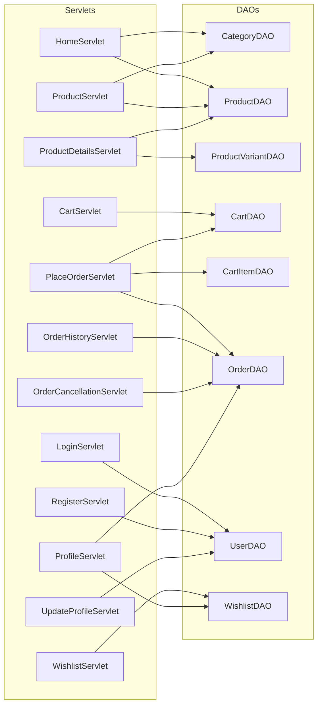
```mermaid
flowchart LR
  subgraph Servlets
    HS[HomeServlet]
    PS[ProductServlet]
    PDS[ProductDetailsServlet]
    CS[CartServlet]
    POS[PlaceOrderServlet]
    OHS[OrderHistoryServlet]
    OCS[OrderCancellationServlet]
    WS[WishlistServlet]
    PrS[ProfileServlet]
    LS[LoginServlet]
    RS[RegisterServlet]
    UPS[UpdateProfileServlet]
  end
  subgraph DAOs
    CatD[CategoryDAO]
    PrD[ProductDAO]
    PvD[ProductVariantDAO]
    CartD[CartDAO]
    CiD[CartItemDAO]
    OrdD[OrderDAO]
    UsrD[UserDAO]
    WshD[WishlistDAO]
  end
  HS --> CatD
  HS --> PrD
  PS --> PrD
  PS --> CatD
  PDS --> PrD
  PDS --> PvD
  CS --> CartD
  POS --> OrdD
  POS --> CartD
  POS --> CiD
  OHS --> OrdD
  OCS --> OrdD
  WS --> WshD
  PrS --> OrdD
  PrS --> WshD
  LS --> UsrD
  RS --> UsrD
  UPS --> UsrD
```

## Simplified class diagram (core domain + DAO facades)

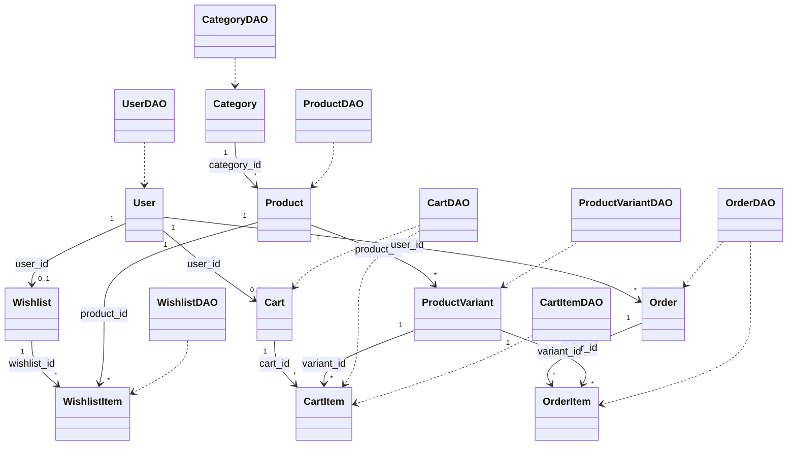
```mermaid
classDiagram
  class User
  class Category
  class Product
  class ProductVariant
  class Cart
  class CartItem
  class Order
  class OrderItem
  class Wishlist
  class WishlistItem

  Category "1" --> "*" Product : category_id
  Product "1" --> "*" ProductVariant : product_id
  User "1" --> "0..1" Cart : user_id
  Cart "1" --> "*" CartItem : cart_id
  ProductVariant "1" --> "*" CartItem : variant_id
  User "1" --> "*" Order : user_id
  Order "1" --> "*" OrderItem : order_id
  ProductVariant "1" --> "*" OrderItem : variant_id
  User "1" --> "0..1" Wishlist : user_id
  Wishlist "1" --> "*" WishlistItem : wishlist_id
  Product "1" --> "*" WishlistItem : product_id

  class UserDAO
  class CategoryDAO
  class ProductDAO
  class ProductVariantDAO
  class CartDAO
  class CartItemDAO
  class OrderDAO
  class WishlistDAO

  UserDAO ..> User
  CategoryDAO ..> Category
  ProductDAO ..> Product
  ProductVariantDAO ..> ProductVariant
  CartDAO ..> Cart
  CartDAO ..> CartItem
  CartItemDAO ..> CartItem
  OrderDAO ..> Order
  OrderDAO ..> OrderItem
  WishlistDAO ..> WishlistItem
```

Relations reflect how the **database** links entities; Java POJOs do not hold object references except `Order.items`.

---

## Sequence diagrams — one per servlet flow

### Home (`GET /home`)

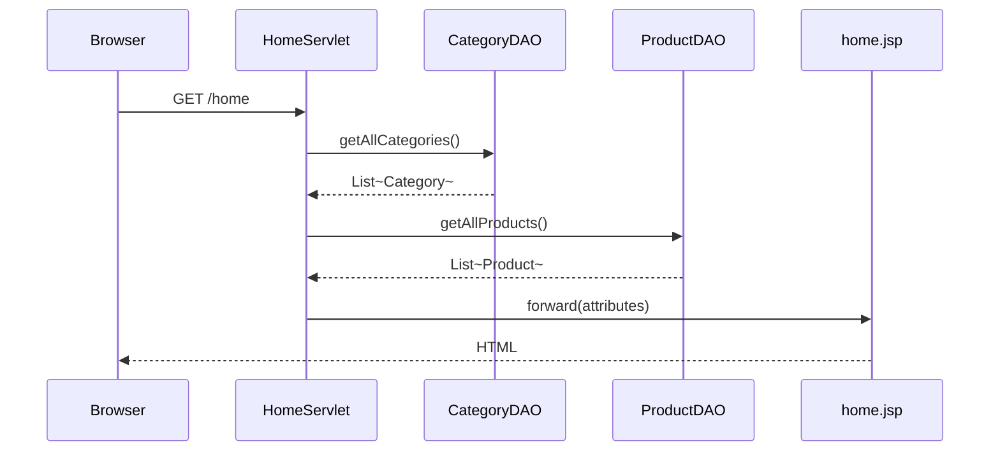
```mermaid
sequenceDiagram
  participant B as Browser
  participant H as HomeServlet
  participant C as CategoryDAO
  participant P as ProductDAO
  participant V as home.jsp
  B->>H: GET /home
  H->>C: getAllCategories()
  C-->>H: List~Category~
  H->>P: getAllProducts()
  P-->>H: List~Product~
  H->>V: forward(attributes)
  V-->>B: HTML
```

### Product listing (`GET /products`)

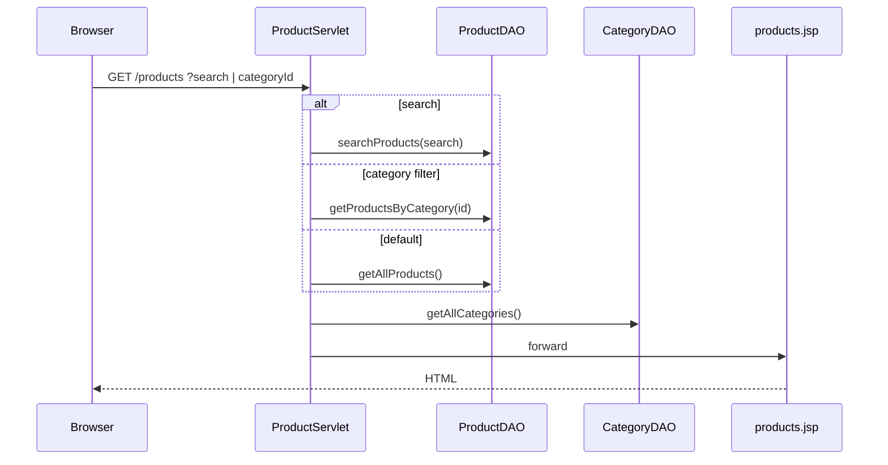
```mermaid
sequenceDiagram
  participant B as Browser
  participant S as ProductServlet
  participant P as ProductDAO
  participant C as CategoryDAO
  participant V as products.jsp
  B->>S: GET /products ?search | categoryId
  alt search
    S->>P: searchProducts(search)
  else category filter
    S->>P: getProductsByCategory(id)
  else default
    S->>P: getAllProducts()
  end
  S->>C: getAllCategories()
  S->>V: forward
  V-->>B: HTML
```

### Product details (`GET /product-details`)

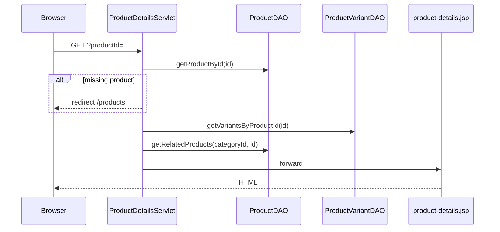
```mermaid
sequenceDiagram
  participant B as Browser
  participant S as ProductDetailsServlet
  participant P as ProductDAO
  participant PV as ProductVariantDAO
  participant V as product-details.jsp
  B->>S: GET ?productId=
  S->>P: getProductById(id)
  alt missing product
    S-->>B: redirect /products
  end
  S->>PV: getVariantsByProductId(id)
  S->>P: getRelatedProducts(categoryId, id)
  S->>V: forward
  V-->>B: HTML
```

### Login (`GET/POST /login`)

`UserDAOImpl.loginUser` loads the row by **email only**, then verifies the password: **BCrypt** if `users.password` starts with `$2a$`, otherwise **plain-text equality** (legacy rows).

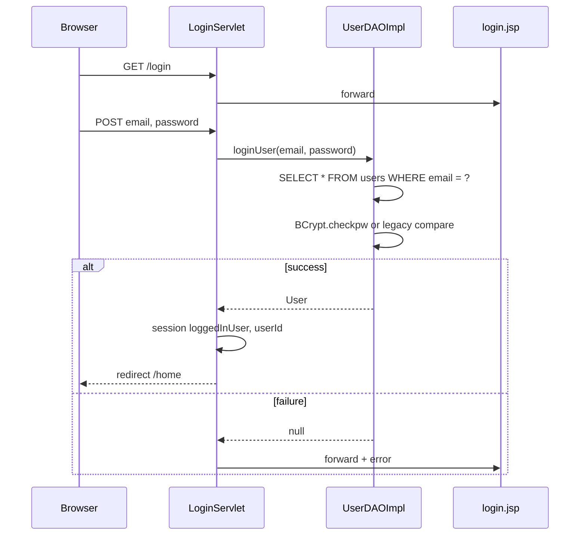
```mermaid
sequenceDiagram
  participant B as Browser
  participant S as LoginServlet
  participant U as UserDAOImpl
  participant V as login.jsp
  B->>S: GET /login
  S->>V: forward
  B->>S: POST email, password
  S->>U: loginUser(email, password)
  U->>U: SELECT * FROM users WHERE email = ?
  U->>U: BCrypt.checkpw or legacy compare
  alt success
    U-->>S: User
    S->>S: session loggedInUser, userId
    S-->>B: redirect /home
  else failure
    U-->>S: null
    S->>V: forward + error
  end
```

### Register (`GET/POST /register`)

`UserDAOImpl.registerUser` stores **BCrypt.hashpw** in `users.password` (not plain text).

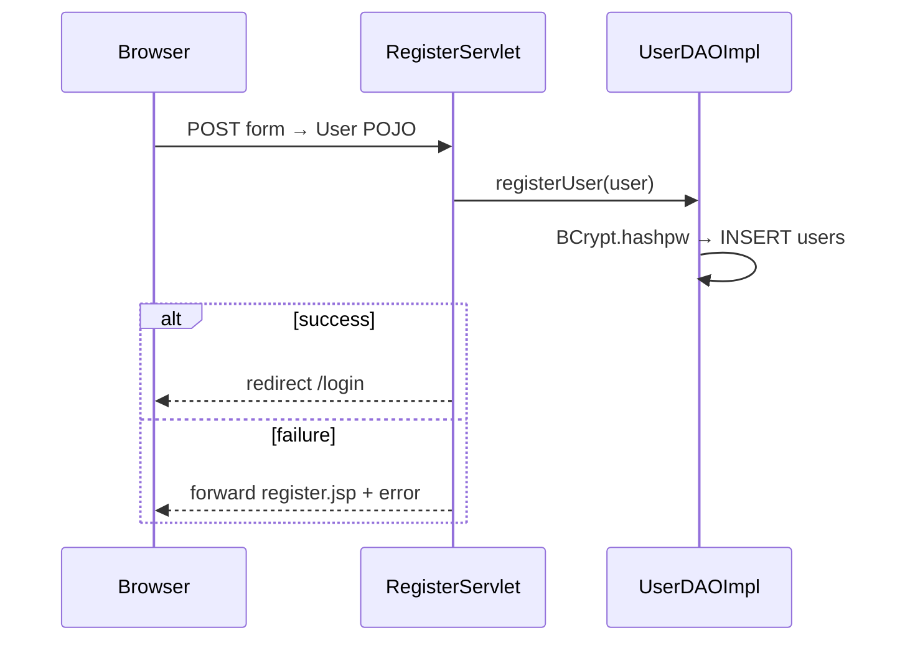
```mermaid
sequenceDiagram
  participant B as Browser
  participant S as RegisterServlet
  participant U as UserDAOImpl
  B->>S: POST form → User POJO
  S->>U: registerUser(user)
  U->>U: BCrypt.hashpw → INSERT users
  alt success
    S-->>B: redirect /login
  else failure
    S-->>B: forward register.jsp + error
  end
```

### Logout (`GET/POST /logout`)

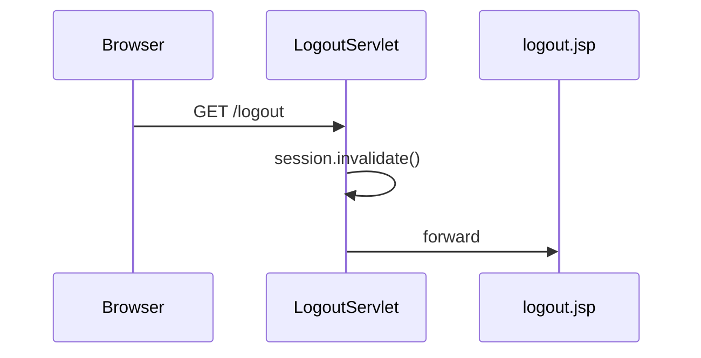
```mermaid
sequenceDiagram
  participant B as Browser
  participant S as LogoutServlet
  participant V as logout.jsp
  B->>S: GET /logout
  S->>S: session.invalidate()
  S->>V: forward
```

### Cart (`GET/POST /cart`)

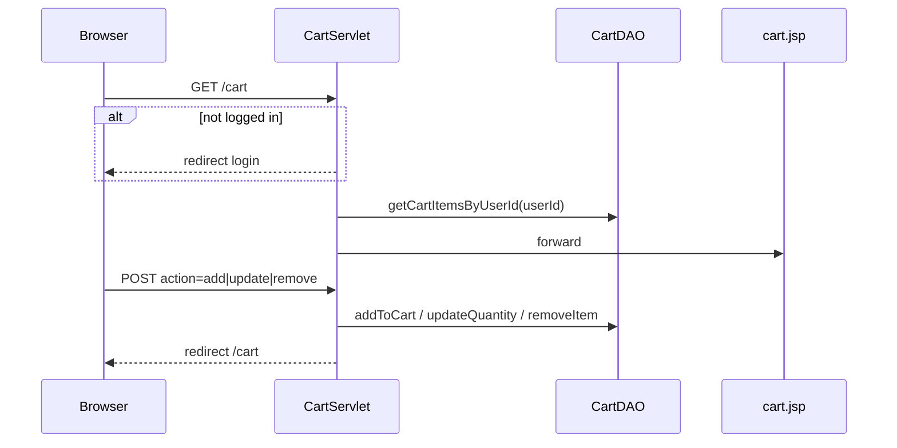
```mermaid
sequenceDiagram
  participant B as Browser
  participant S as CartServlet
  participant C as CartDAO
  participant V as cart.jsp
  B->>S: GET /cart
  alt not logged in
    S-->>B: redirect login
  end
  S->>C: getCartItemsByUserId(userId)
  S->>V: forward
  B->>S: POST action=add|update|remove
  S->>C: addToCart / updateQuantity / removeItem
  S-->>B: redirect /cart
```

### Checkout (`GET /checkout`)

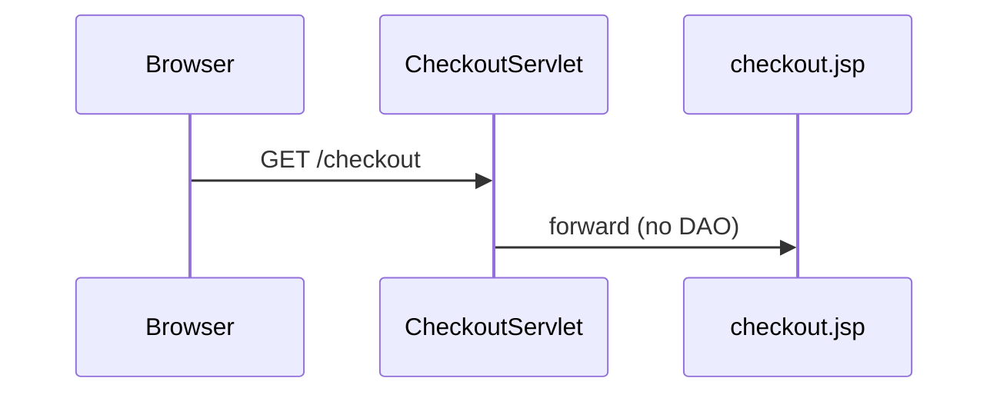
```mermaid
sequenceDiagram
  participant B as Browser
  participant S as CheckoutServlet
  participant V as checkout.jsp
  B->>S: GET /checkout
  S->>V: forward (no DAO)
```

### Place order (`POST /place-order`)

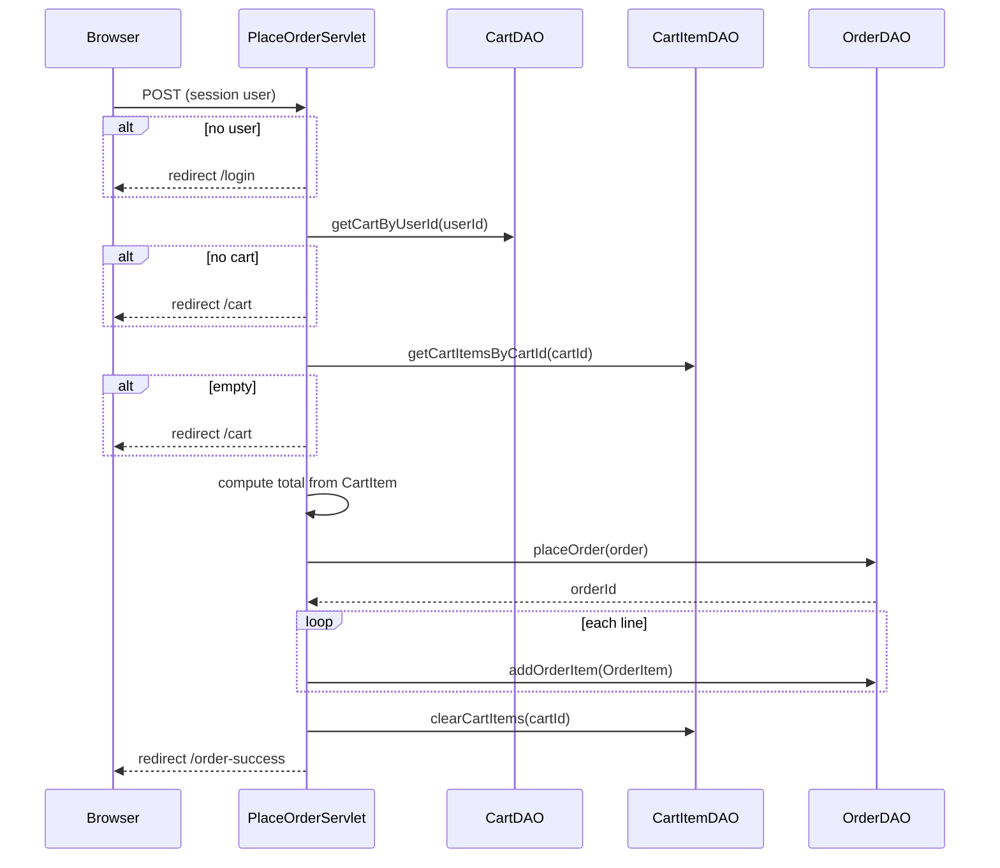
```mermaid
sequenceDiagram
  participant B as Browser
  participant S as PlaceOrderServlet
  participant Cart as CartDAO
  participant CI as CartItemDAO
  participant O as OrderDAO
  B->>S: POST (session user)
  alt no user
    S-->>B: redirect /login
  end
  S->>Cart: getCartByUserId(userId)
  alt no cart
    S-->>B: redirect /cart
  end
  S->>CI: getCartItemsByCartId(cartId)
  alt empty
    S-->>B: redirect /cart
  end
  S->>S: compute total from CartItem
  S->>O: placeOrder(order)
  O-->>S: orderId
  loop each line
    S->>O: addOrderItem(OrderItem)
  end
  S->>CI: clearCartItems(cartId)
  S-->>B: redirect /order-success
```

### Order history (`GET /order-history`)

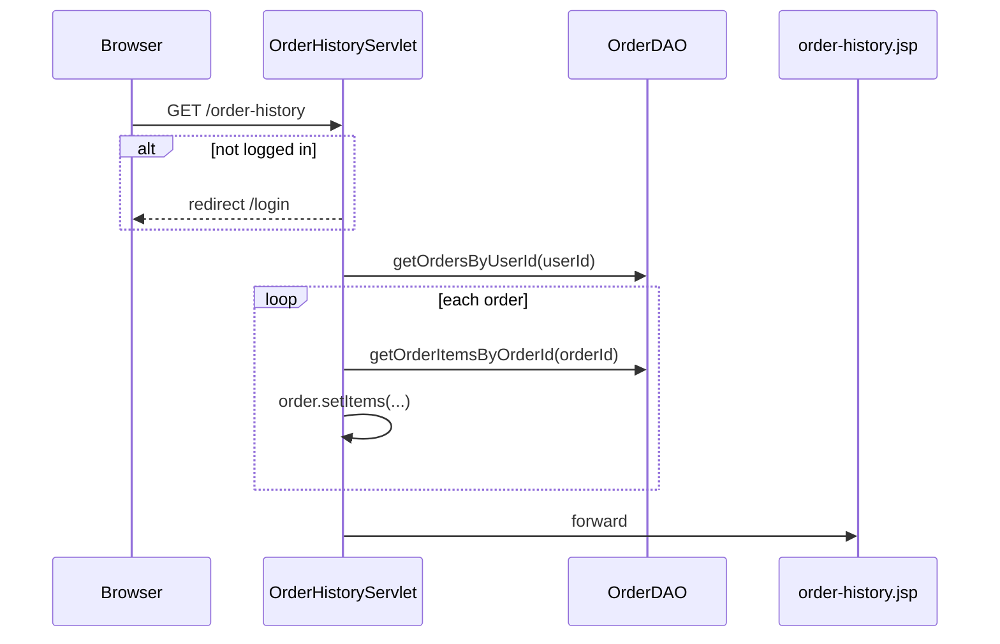
```mermaid
sequenceDiagram
  participant B as Browser
  participant S as OrderHistoryServlet
  participant O as OrderDAO
  participant V as order-history.jsp
  B->>S: GET /order-history
  alt not logged in
    S-->>B: redirect /login
  end
  S->>O: getOrdersByUserId(userId)
  loop each order
    S->>O: getOrderItemsByOrderId(orderId)
    S->>S: order.setItems(...)
  end
  S->>V: forward
```

### Cancel order (`POST /cancel-order`)

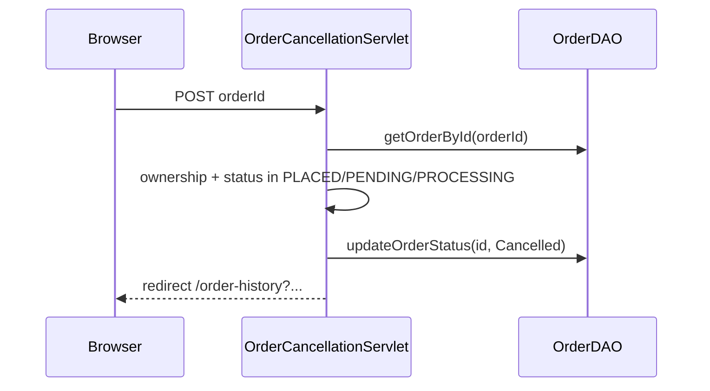
```mermaid
sequenceDiagram
  participant B as Browser
  participant S as OrderCancellationServlet
  participant O as OrderDAO
  B->>S: POST orderId
  S->>O: getOrderById(orderId)
  S->>S: ownership + status in PLACED/PENDING/PROCESSING
  S->>O: updateOrderStatus(id, Cancelled)
  S-->>B: redirect /order-history?...
```

### Order success (`GET /order-success`)

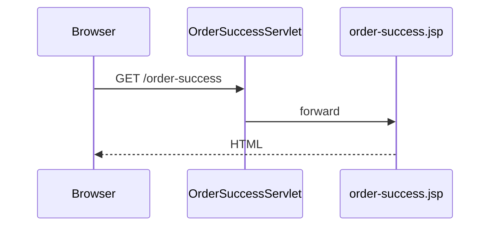
```mermaid
sequenceDiagram
  participant B as Browser
  participant S as OrderSuccessServlet
  participant V as order-success.jsp
  B->>S: GET /order-success
  S->>V: forward
  V-->>B: HTML
```

### Profile (`GET /profile`)

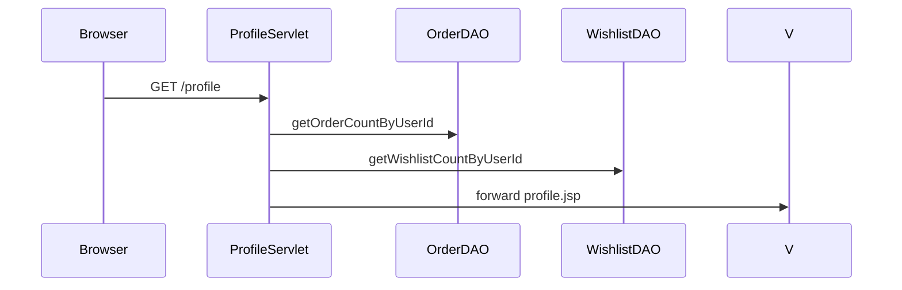
```mermaid
sequenceDiagram
  participant B as Browser
  participant S as ProfileServlet
  participant O as OrderDAO
  participant W as WishlistDAO
  B->>S: GET /profile
  S->>O: getOrderCountByUserId
  S->>W: getWishlistCountByUserId
  S->>V: forward profile.jsp
```

### Update profile (`POST /update-profile`)

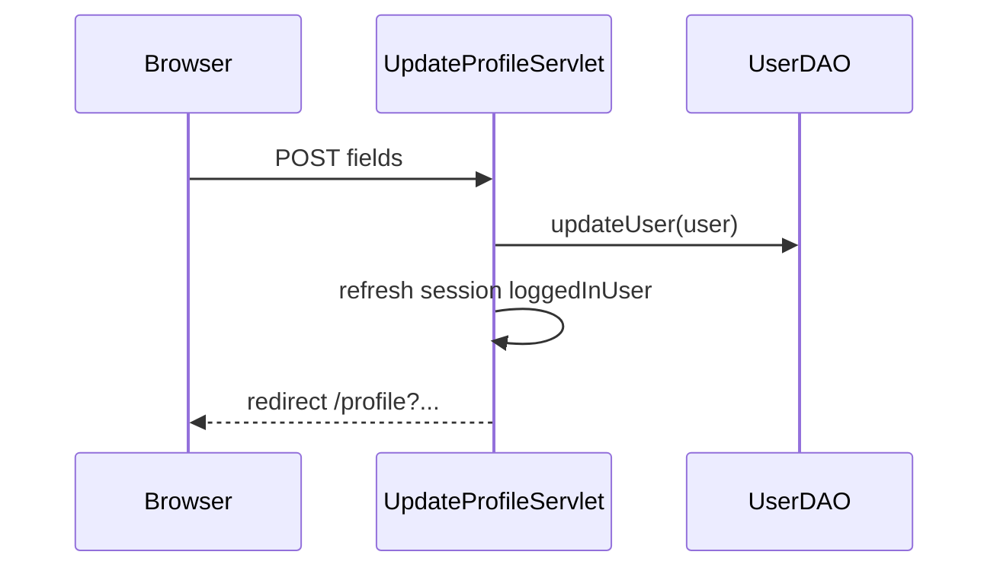
```mermaid
sequenceDiagram
  participant B as Browser
  participant S as UpdateProfileServlet
  participant U as UserDAO
  B->>S: POST fields
  S->>U: updateUser(user)
  S->>S: refresh session loggedInUser
  S-->>B: redirect /profile?...
```

### Wishlist (`GET/POST /wishlist`)

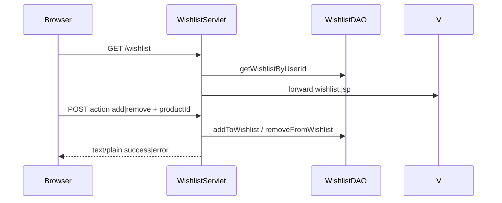
```mermaid
sequenceDiagram
  participant B as Browser
  participant S as WishlistServlet
  participant W as WishlistDAO
  B->>S: GET /wishlist
  S->>W: getWishlistByUserId
  S->>V: forward wishlist.jsp
  B->>S: POST action add|remove + productId
  S->>W: addToWishlist / removeFromWishlist
  S-->>B: text/plain success|error
```

---

## Design observations (for reviewers)

1. **No service layer** — transaction boundaries for checkout are split across `OrderDAO`, `CartItemDAO`; failures mid-flow could leave inconsistent state without explicit transactions.
2. **`OrderDAOImpl`** exposes both `placeOrder` (full column insert) and legacy `createOrder` (narrow insert); only `placeOrder` is used from `PlaceOrderServlet`.
3. **`OrderItemDAO` / `OrderItemDAOImpl`** exist but are **not referenced** by any servlet; order lines are written through `OrderDAO.addOrderItem`.
4. **`CheckoutServlet`** is presentation-only; cart validation happens in `PlaceOrderServlet`.
5. **Passwords** — new users get BCrypt hashes; legacy DB rows may still use plain text until migrated. Session holds full `User` including password field — consider a DTO or stripping sensitive fields before `setAttribute`.
