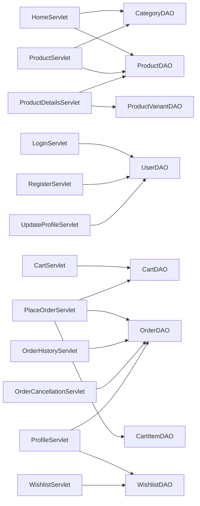

# Controllers and data access

## URL map (servlets)

All mappings are `@WebServlet` annotations; context path is prefixed at runtime (e.g. `/FashionStore/home`).

| Path | Class | DAO usage |
|------|-------|-----------|
| `/home` | `HomeServlet` | `CategoryDAO`, `ProductDAO` |
| `/products` | `ProductServlet` | `ProductDAO`, `CategoryDAO` |
| `/product-details` | `ProductDetailsServlet` | `ProductDAO`, `ProductVariantDAO` |
| `/login` | `LoginServlet` | `UserDAO` (email lookup + BCrypt or legacy password check) |
| `/register` | `RegisterServlet` | `UserDAO` (BCrypt hash on insert) |
| `/logout` | `LogoutServlet` | *(none)* |
| `/cart` | `CartServlet` | `CartDAO` |
| `/checkout` | `CheckoutServlet` | *(none — JSP only)* |
| `/place-order` | `PlaceOrderServlet` | `OrderDAO`, `CartDAO`, `CartItemDAO` |
| `/order-success` | `OrderSuccessServlet` | *(none)* |
| `/order-history` | `OrderHistoryServlet` | `OrderDAO` |
| `/cancel-order` | `OrderCancellationServlet` | `OrderDAO` |
| `/profile` | `ProfileServlet` | `OrderDAO`, `WishlistDAO` |
| `/update-profile` | `UpdateProfileServlet` | `UserDAO` |
| `/wishlist` | `WishlistServlet` | `WishlistDAO` |

## Controller → DAO dependency (graph)

## DAO → database tables

| DAO | Tables touched (from SQL strings) |
|-----|----------------------------------|
| `UserDAOImpl` | `users` |
| `CategoryDAOImpl` | `categories` |
| `ProductDAOImpl` | `products` (+ joins to `product_variants` for filters) |
| `ProductVariantDAOImpl` | `product_variants` |
| `CartDAOImpl` | `cart`, `cart_items`, `product_variants`, `products` |
| `CartItemDAOImpl` | `cart_items`, `product_variants`, `products` |
| `OrderDAOImpl` | `orders`, `order_items`, `product_variants`, `products` |
| `WishlistDAOImpl` | `wishlist`, `wishlist_items`, `products` |

## DAO interfaces with no servlet callers (current codebase)

| Type | Note |
|------|------|
| `OrderItemDAO` / `OrderItemDAOImpl` | Order line persistence goes through `OrderDAO.addOrderItem` and list via `OrderDAO.getOrderItemsByOrderId`. |

## Typical call chain (example: checkout completion)

1. **Browser** → `POST /place-order`
2. **`PlaceOrderServlet`** → `CartDAO.getCartByUserId`
3. **`PlaceOrderServlet`** → `CartItemDAO.getCartItemsByCartId`
4. **`PlaceOrderServlet`** → `OrderDAO.placeOrder` then `OrderDAO.addOrderItem` (loop)
5. **`PlaceOrderServlet`** → `CartItemDAO.clearCartItems`
6. **Redirect** → `GET /order-success`

This is the longest orchestration path in the project and the main place to add a **transaction** (single JDBC connection + `setAutoCommit(false)`) if you harden data consistency.
