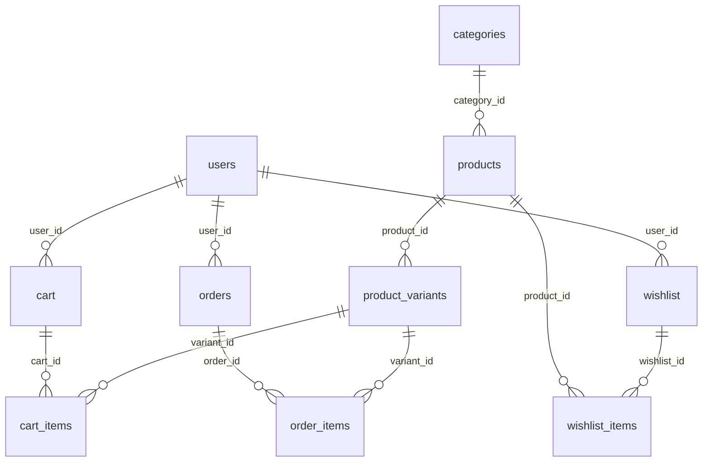

# Database documentation

## Connection

- JDBC configuration lives in `com.fashionstore.util.DBConnection` (URL, user, password, MySQL driver).
- Database name used in code: **`fashion_store`**.

No SQL migration scripts ship with this project; the schema below is **inferred from DAO SQL** and should be validated against your live MySQL instance.

---

## Entity–relationship diagram (logical)

---

## Tables, columns, and Java mapping

### `users`

| Column (inferred) | Java |
|-------------------|------|
| `user_id` PK | `User.userId` |
| `full_name` | `fullName` |
| `email` | `email` |
| `phone` | `phone` |
| `password` | `password` — **BCrypt** string for new registrations (`BCrypt.hashpw`); login accepts legacy **plain** values until migrated |
| `address_line1` … `country` | address fields |
| `created_at` (read in model) | `createdAt` |

**DAO:** `UserDAO` / `UserDAOImpl` — register (hash password), login (load by email, then `BCrypt.checkpw` or legacy compare), get by id/email/phone, update profile/password, list users.

---

### `categories`

| Column | Java |
|--------|------|
| `category_id` PK | `Category.categoryId` |
| `category_name` | `categoryName` |
| `description` | `description` |

**DAO:** `CategoryDAO` / `CategoryDAOImpl`.

---

### `products`

| Column | Java |
|--------|------|
| `product_id` PK | `Product.productId` |
| `category_id` FK | `categoryId` |
| `product_name`, `brand`, `description` | strings |
| `price`, `discount_percent` | doubles |
| `image_url` | `imageUrl` |
| `is_active` | `isActive` |
| `created_at` | `createdAt` |

**DAO:** `ProductDAO` / `ProductDAOImpl` — CRUD-style operations, search, filter by category, related products.

---

### `product_variants`

| Column | Java |
|--------|------|
| `variant_id` PK | `ProductVariant.variantId` |
| `product_id` FK | `productId` |
| `size` | `size` |
| `stock_quantity` | `stockQuantity` |
| `is_available` | `isAvailable` |

**DAO:** `ProductVariantDAO` / `ProductVariantDAOImpl` — stock adjust helpers used for catalog/inventory maintenance.

---

### `cart`

| Column | Java |
|--------|------|
| `cart_id` PK | `Cart.cartId` |
| `user_id` FK | `userId` |
| `created_at`, `updated_at` | timestamps |

**DAO:** `CartDAO` / `CartDAOImpl` — ensure cart, fetch by user, add line items (with merge logic), list enriched cart lines, update/remove lines, clear/delete cart.

---

### `cart_items`

| Column | Java |
|--------|------|
| `cart_item_id` PK | `CartItem.cartItemId` |
| `cart_id` FK | `cartId` |
| `variant_id` FK | `variantId` |
| `quantity`, `unit_price` | `quantity`, `unitPrice` |
| `added_at` | `addedAt` |

Joined columns from `products` / `product_variants` populate `productId`, `productName`, `size`, `imageUrl`.

**DAO:** `CartDAO` (primary for servlet flows), `CartItemDAO` / `CartItemDAOImpl` (full CRUD by cart; used by `PlaceOrderServlet` for reads and clear).

---

### `orders`

| Column | Java |
|--------|------|
| `order_id` PK | `Order.orderId` |
| `user_id` FK | `userId` |
| `order_date` | `orderDate` |
| `total_amount` | `totalAmount` |
| `payment_method` | `paymentMethod` |
| `order_status` | `orderStatus` |
| `delivery_name`, `delivery_phone`, address fields… | `delivery*` |
| `created_at`, `updated_at` | `createdAt`, `updatedAt` |

**DAO:** `OrderDAO` / `OrderDAOImpl` — insert order (`placeOrder`), fetch, list by user, update status, aggregate order count, append/list order lines.

**Legacy path:** `createOrder` inserts `(user_id, total_amount, status)` — may not match your physical table if only the main `placeOrder` path was used when creating the schema.

---

### `order_items`

| Column | Java |
|--------|------|
| `order_id` FK | `OrderItem.orderId` |
| `variant_id` FK | `variantId` |
| `quantity`, `price`, `subtotal` | numeric fields |

Queries join `product_variants` and `products` to fill `productId`, `productName`, `imageUrl` on `OrderItem`.

**DAO:** Inserts and enriched reads are on **`OrderDAO`** in current app flow. `OrderItemDAO` exists but is unused by controllers.

---

### `wishlist`

| Column | Java |
|--------|------|
| `wishlist_id` PK | `Wishlist.wishlistId` |
| `user_id` FK | `userId` |
| `created_at` | `createdAt` |

**DAO:** `WishlistDAO` / `WishlistDAOImpl` — ensure row per user, counts.

---

### `wishlist_items`

| Column | Java |
|--------|------|
| `wishlist_item_id` PK | `WishlistItem.wishlistItemId` |
| `wishlist_id` FK | `wishlistId` |
| `product_id` FK | `productId` |
| `added_at` | `addedAt` |

Joined product fields: `productName`, `price`, `imageUrl` on `WishlistItem`.

**DAO:** `WishlistDAO` / `WishlistDAOImpl`.

---

## Summary: table → primary DAO classes

| Table | Primary DAO(s) |
|-------|----------------|
| `users` | `UserDAOImpl` |
| `categories` | `CategoryDAOImpl` |
| `products` | `ProductDAOImpl` |
| `product_variants` | `ProductVariantDAOImpl` |
| `cart`, `cart_items` | `CartDAOImpl`, `CartItemDAOImpl` |
| `orders`, `order_items` | `OrderDAOImpl` |
| `wishlist`, `wishlist_items` | `WishlistDAOImpl` |
